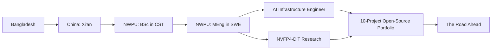

<h1 align="center">
  
</h1>

  
  &nbsp;
  
  &nbsp;
  
  &nbsp;
  

  
  
  
  

---

> I'm an AI Infrastructure Engineer who builds **fast, cost-efficient LLM serving systems**. I take inference research — KV-cache disaggregation, FP4 quantization, and RDMA-scale compute — and turn it into measurable production wins on A800/H200 clusters. I'm an M.Eng. candidate at NWPU and the author of **NVFP4-DiT** (IEEE TMM, under review).

### Currently
- 🛠️ Building a **10-project open-source AI-infra portfolio** to sharpen and showcase production engineering.
- 📄 Writing my M.Eng. thesis on multimodal deepfake detection.
- 💡 Open to AI Infrastructure / LLM-serving engineering roles.

---

### My Journey

---

### What I Do

- **AI Infrastructure** — KV-cache architecture, prefill/decode disaggregation, SGLang/vLLM, RDMA, A800/H200 clusters.
- **Low-Precision Inference** — FP8/FP4 quantization for LLMs and diffusion transformers.
- **M.Eng. Software Engineering** @ NWPU — LLM inference optimization & multimodal AI.

### Focus

- **LLM Serving at Scale** — KV-cache disaggregation (PD split), prefix caching & continuous batching on SGLang/vLLM across A800/H200.
- **Low-Precision Inference** — FP8/FP4 quantization for LLMs and diffusion transformers; author of NVFP4-DiT (IEEE TMM, under review).
- **Distributed GPU Systems** — RDMA-based multi-node training/inference and cluster orchestration.
- **GPU Kernels** — CUDA / Triton / FlashAttention kernels for attention and GEMM.
- **Multimodal AI** — audio-visual-temporal fusion for deepfake detection and video generation.

### Key Achievements

| Metric | Result | Context |
|--------|--------|---------|
| KV-cache hit rate | **92.27%** | prefix-cache tuned serving |
| TTFT reduction | **8.3×** | 4× A800 PD-disaggregation |
| Memory reduction | **4×** | FP4 quantization (NVFP4-DiT) |
| Thesis | **70 pages** | multimodal deepfake detection |
| Scholarship | Chinese Gov. Scholarship | NWPU M.Eng. |

### Experience

**AI Infrastructure Engineer Intern** · [InfiX.ai](https://infix.io/) · Shenzhen, China · Apr 2026 – Jun 2026

### Education

| Degree | University | Period |
|--------|-----------|--------|
| M.Eng. Software Engineering | Northwestern Polytechnical University (985/211) | Sep 2024 – Mar 2027 |
| B.Eng. Computer Science & Technology | Northwestern Polytechnical University (985/211) | Sep 2020 – Jul 2024 |

### Research Interests

- AI Infrastructure & LLM Inference Systems (KV-cache, PD disaggregation, RDMA)
- Multimodal AI (visual + audio + temporal fusion, deepfake detection, video generation)
- Low-Precision Quantization (FP8/FP4 for diffusion transformers and LLMs)
- GPU Kernel Optimization (CUDA, Triton, FlashAttention, GEMM)

### Open to Collaboration

- LLM serving infrastructure and distributed systems
- Multimodal AI and computer vision research
- Open-source AI tooling and frameworks
- Always happy to connect via email or LinkedIn

---

### 🚀 AI Infrastructure Portfolio

A curated set of **10 production-quality, fully-tested, Dockerized** AI-infra projects — each with a clear architecture, quickstart, and CI. Showcased in [**ai-infra-portfolio**](https://github.com/theraihanrakibb/ai-infra-portfolio).

| Project | Area | What it does |
|---------|------|--------------|
| [llm-gateway](https://github.com/theraihanrakibb/llm-gateway) | LLM Gateway | OpenAI-compatible proxy: per-key rate limits, cost caps, caching, provider fallback. |
| [mini-serve](https://github.com/theraihanrakibb/mini-serve) | Model Serving | Inference server: dynamic batching, SSE streaming, Prometheus metrics. |
| [gpu-exporter](https://github.com/theraihanrakibb/gpu-exporter) | Observability | NVIDIA GPU Prometheus exporter + Grafana dashboard. |
| [train-launcher](https://github.com/theraihanrakibb/train-launcher) | Training Ops | Fault-tolerant multi-node PyTorch launcher with auto-retry. |
| [model-registry](https://github.com/theraihanrakibb/model-registry) | MLOps | Content-addressed model/dataset registry (mini-MLflow) with aliases. |
| [kv-cache-sim](https://github.com/theraihanrakibb/kv-cache-sim) | Inference Eff. | KV-cache eviction + prefill/decode disaggregation simulator (TTFT/TPOT). |
| [llm-bench](https://github.com/theraihanrakibb/llm-bench) | Benchmarking | LLM benchmark/eval harness: TTFT, TPOT, throughput, cost model. |
| [quant-playground](https://github.com/theraihanrakibb/quant-playground) | Low Precision | FP8/FP4/INT8/INT4 bit-packing + numpy MLP quantization demo. |
| [llmoops-trace](https://github.com/theraihanrakibb/llmoops-trace) | Observability | OpenTelemetry LLM tracing collector + Grafana dashboard. |
| [rag-pipeline](https://github.com/theraihanrakibb/rag-pipeline) | Retrieval (RAG) | Offline RAG toolkit: ingest → chunk → embed → ANN search → rerank. |

### Featured Research & Engineering

| Project | Description |
|---------|-------------|
| [NVFP4-DiT](https://github.com/theraihanrakibb/NVFP4-DiT) | 4-bit low-precision audio-guided video diffusion transformer (IEEE TMM, under review). |
| [DeepfakeAudioVisualTemporalDetector](https://github.com/theraihanrakibb/DeepfakeAudioVisualTemporalDetector) | Multimodal deepfake detection: EfficientNet + FFT + MFCC + Transformer + Attention Fusion. |
| [Compiler-C](https://github.com/theraihanrakibb/Compiler-C) | C compiler with lexer, parser, and code generation (Yacc/Lex). |
| [Online-Portfolio](https://github.com/theraihanrakibb/Online-Portfolio) | Personal portfolio website. |

### Publication

- **NVFP4-DiT: 4-bit Audio-Guided Video Diffusion Transformers** — IEEE TMM, under review.

### Tech Stack

---

### GitHub Stats

  

  
  

---

  

  <i>“Inference is where the model meets the metal — I make that intersection fast, cheap, and observable.”</i>

