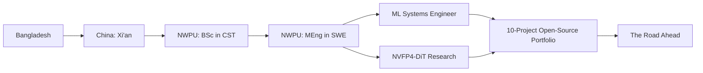

<h1 align="center">
  
</h1>

  
  &nbsp;
  
  &nbsp;
  
  &nbsp;
  
  &nbsp;
  

  
  
  
  

---

> I'm an ML Systems Engineer working on two equal fronts: **LLM inference infrastructure** (3-tier KV-cache offload over Mooncake RDMA, PD-disaggregation, FP8/FP4 on 4× A800-80GB and H200 clusters) and **multimodal AI** (audio-guided video diffusion, deepfake detection). I'm an M.Eng. candidate at NWPU (Top 1%) and first author of **NVFP4-DiT** (IEEE TNNLS, under review).

### ⚡ At a glance

| | |
|---|---|
| 🎯 **Focus** | LLM inference systems — KV-cache offload, PD disaggregation, FP8/FP4 low-precision |
| 📈 **Headline result** | **8.3× TTFT** (55s → 6.7s) at **92%** KV-cache hit, on 4× A800-80GB |
| 🔬 **Research** | First author, **NVFP4-DiT** — 4× memory, **3.2× faster than FP16** (IEEE TNNLS, under review) |
| 🖥️ **Hardware** | 4× A800-80GB · 8× H200 · H100 |
| 🎓 **Status** | M.Eng. NWPU (Top 1%) · 2027 New Grad · available Jul 2027 |

### Currently
- 🎓 **ML Systems Engineer | LLM Inference & Multimodal AI** — 2027 New Grad, open to AI/ML, Research Engineer & AI Infrastructure roles across **Mainland China & Hong Kong** (MNC & global AI R&D); available **Jul 2027**.
- 🛠️ Building an **open-source AI-infra portfolio** (LLM serving, KV-cache, RDMA, FP8 quantization) to sharpen and showcase production systems engineering.
- 📄 Writing my M.Eng. thesis on **multimodal deepfake detection** (visual + audio + temporal inconsistencies); first author of **NVFP4-DiT** (IEEE TNNLS, Q1, under review).

---

### 📄 Resume / CV

> 🎓 **New Graduate 2027** targeting AI Infrastructure / LLM Inference engineering roles at MNC & global AI R&D centers across **Mainland China + Hong Kong**.

  
  &nbsp; <a href="https://raw.githubusercontent.com/theraihanrakibb/theraihanrakibb/main/CL_Raihan_MLSys_NWPU_2027.pdf">Cover Letter (PDF)</a>

---

### My Journey

```mermaid
flowchart LR
    BD[Bangladesh] --> CN[China: Xi'an]
    CN --> BS[NWPU: BSc in CST]
    BS --> MS[NWPU: MEng in SWE]
    MS --> AI[ML Systems Engineer]
    MS --> RS[NVFP4-DiT Research]
    AI --> PF[10-Project Open-Source Portfolio]
    RS --> PF
    PF --> FUT[The Road Ahead]
```

---

### What I Do

- **AI Infrastructure** — 3-tier KV-cache offload, prefill/decode disaggregation, SGLang (v0.5.9 / v0.5.10-post2), RDMA, 4× A800-80GB + 2×/8× H200 clusters.
- **Low-Precision Inference** — FP8/FP4 quantization for LLMs and diffusion transformers.
- **Multimodal AI** — audio-guided video diffusion (NVFP4-DiT) and audio-visual deepfake detection research.
- **LLM / NLP Agents** — LLM-agent workflow automation (Amraim Group) and multimodal understanding.

### Focus

**Inference Infrastructure**
- **LLM Serving at Scale** — 3-tier KV-cache offload (GPU HBM → CPU DRAM → SSD) over Mooncake RDMA, PD-disaggregation, prefix caching & continuous batching on SGLang across 4× A800-80GB.
- **Low-Precision Inference** — FP8/FP4 quantization for LLMs and diffusion transformers; FP8 KV cache halves per-token KV memory (72.9 → 36.5 KB); author of NVFP4-DiT (IEEE TNNLS, under review).
- **Distributed GPU Systems** — RDMA-based multi-node training/inference and cluster orchestration.
- **GPU Kernels** — CUDA / Triton / FlashAttention kernels for attention and GEMM.

**Multimodal & NLP**
- **Multimodal Generation** — audio-guided video diffusion transformers (NVFP4-DiT) with FP4-packed Triton kernels, benchmarked on H100.
- **Multimodal Understanding** — audio-visual-temporal fusion for deepfake detection.
- **LLM Agents & NLP** — LLM-agent workflow automation and multimodal understanding (Amraim Group internship).

### Key Achievements

| Metric | Result | Context |
|--------|--------|---------|
| KV-cache hit rate | **92%** | 3-tier offload over Mooncake RDMA, long-context (32K+ tokens) |
| TTFT reduction | **8.3×** (55s → 6.7s) | Qwen3.5/3.6-27B on 4× A800-80GB |
| Stable concurrency | **192 → 256** | 2+2 GPU prefill/decode disaggregation |
| DeepSeek-V3.2 on 8× H200 | **91 ms TTFT / 36 ms TPOT** @32–64 · **13.16 req/s** @256 | FP8, SGLang benchmark |
| GEMM profiling | **60%** of step time | Nsight Systems — redirected optimization to compute kernels |
| KV memory per token | **72.9 → 36.5 KB** | FP8 KV cache |
| Kernel speedup | **3.2× vs FP16** (2.1× vs naive FP4) | FP4-packed Triton kernels (NVFP4-DiT) |
| Memory reduction | **4×** | NVFP4-DiT on H100 |
| M.Eng. Thesis | **deepfake detection** | multimodal audio-visual-temporal framework |
| Scholarships | Chinese Gov. · NWPU Presidential · Wu Yajun | NWPU M.Eng. |

### Experience

- **AI Infrastructure Engineer Intern** | InfiX.ai | Shenzhen, China | Apr 2026 - Jun 2026
- **Software Engineer Intern (AI Agent)** | Hong Kong Amraim Group Co., Ltd. | Shenzhen, China | Jun 2025 - Sep 2025
- **Electrical Software Engineer Intern** | Shaanxi Longong Intelligent Technology Co., Ltd. | Xi'an, China | Feb 2025 - Apr 2025

### Education

| Degree | University | Period | Thesis |
|--------|-----------|--------|--------|
| M.Eng. Software Engineering | Northwestern Polytechnical University (985/211) | Sep 2024 – Jul 2027 \| GPA 88/100 (Top 1%) | [M.Eng. Thesis](https://github.com/theraihanrakibb/M.Eng-Thesis-Multimodal-Deepfake-Audio-Visual-Temporal-Framework) |
| B.Eng. Computer Science & Technology | Northwestern Polytechnical University (985/211) | Sep 2020 – Jul 2024 \| GPA 85/100 (Top 1%) | [B.Eng. Thesis](https://github.com/theraihanrakibb/B.Eng-Thesis-Design-and-Implementation-of-a-Distributed-Confidential-Query-Protocol-for-Spark) |

### Awards & Certifications

- **Scholarships:** Chinese Government Scholarship (2024–2027) · NWPU Presidential Scholarship (2020–2024) · Wu Yajun Scholarship (2024)
- **Certifications:** AWS Certified Machine Learning – Specialty · Professional Scrum Master I (PSM I), Scrum.org · Deep Learning Specialization (DeepLearning.AI)

### Research Interests

- AI Infrastructure & LLM Inference Systems (KV-cache, PD disaggregation, RDMA)
- Multimodal AI (visual + audio + temporal fusion, deepfake detection, video generation)
- Low-Precision Quantization (FP8/FP4 for diffusion transformers and LLMs)
- GPU Kernel Optimization (CUDA, Triton, FlashAttention, GEMM)

### Open to Collaboration

- LLM serving infrastructure and distributed systems
- Multimodal AI and computer vision research
- Open-source AI tooling and frameworks
- Always happy to connect via email or LinkedIn

---

### 🚀 AI Infrastructure Portfolio

A curated set of **10 production-quality, fully-tested, Dockerized** AI-infra projects — each with a clear architecture, quickstart, and CI. Showcased in [**ai-infra-portfolio**](https://github.com/theraihanrakibb/ai-infra-portfolio).

<b>Show all 10 projects ↓</b>

| Project | Area | What it does |
|---------|------|--------------|
| [llm-gateway](https://github.com/theraihanrakibb/llm-gateway) | LLM Gateway | OpenAI-compatible proxy: per-key rate limits, cost caps, caching, provider fallback. |
| [mini-serve](https://github.com/theraihanrakibb/mini-serve) | Model Serving | Inference server: dynamic batching, SSE streaming, Prometheus metrics. |
| [gpu-exporter](https://github.com/theraihanrakibb/gpu-exporter) | Observability | NVIDIA GPU Prometheus exporter + Grafana dashboard. |
| [train-launcher](https://github.com/theraihanrakibb/train-launcher) | Training Ops | Fault-tolerant multi-node PyTorch launcher with auto-retry. |
| [model-registry](https://github.com/theraihanrakibb/model-registry) | MLOps | Content-addressed model/dataset registry (mini-MLflow) with aliases. |
| [kv-cache-sim](https://github.com/theraihanrakibb/kv-cache-sim) | Inference Eff. | KV-cache eviction + prefill/decode disaggregation simulator (TTFT/TPOT). |
| [llm-bench](https://github.com/theraihanrakibb/llm-bench) | Benchmarking | LLM benchmark/eval harness: TTFT, TPOT, throughput, cost model. |
| [quant-playground](https://github.com/theraihanrakibb/quant-playground) | Low Precision | FP8/FP4/INT8/INT4 bit-packing + numpy MLP quantization demo. |
| [llmoops-trace](https://github.com/theraihanrakibb/llmoops-trace) | Observability | OpenTelemetry LLM tracing collector + Grafana dashboard. |
| [rag-pipeline](https://github.com/theraihanrakibb/rag-pipeline) | Retrieval (RAG) | Offline RAG toolkit: ingest → chunk → embed → ANN search → rerank. |

### 🎨 Multimodal & NLP Projects

Research-driven multimodal and NLP work — taking generative and understanding models from paper to reproducible artifacts.

| Project | Area | What it does |
|---------|------|--------------|
| [NVFP4-DiT](https://github.com/theraihanrakibb/NVFP4-DiT) | Multimodal Generation | 4-bit audio-guided video diffusion transformer (IEEE TNNLS, under review): FP4-packed Triton kernels → **4× memory reduction** and **3.2× faster than FP16** (2.1× vs naive FP4), evaluated on WebVid-10M, VGGSound and UCF-101 on H100; includes a vLLM-style serving scheduler (frame-level paged attention, dynamic frame batching). |
| [Multimodal Deepfake Detection](https://github.com/theraihanrakibb/M.Eng-Thesis-Multimodal-Deepfake-Audio-Visual-Temporal-Framework) | Multimodal Understanding | Audio-visual-temporal framework for deepfake video detection (M.Eng. thesis). |

### ⭐ Featured Work

<table>
<tr>
<td width="50%" align="center">

<b>NVFP4-DiT</b> 4-bit audio-guided video diffusion — 4× memory, 3.2× faster than FP16.
</td>
<td width="50%" align="center">

<b>Online-Portfolio</b> Bilingual personal site with benchmark evidence.
</td>
</tr>
</table>

### Featured Research & Engineering

| Project | Description |
|---------|-------------|
| [NVFP4-DiT](https://github.com/theraihanrakibb/NVFP4-DiT) | 4-bit low-precision audio-guided video diffusion transformer (IEEE TNNLS, under review) — FP4 Triton kernels, QAT with learnable cross-modal scales, vLLM-style scheduler. |
| [M.Eng. Thesis](https://github.com/theraihanrakibb/M.Eng-Thesis-Multimodal-Deepfake-Audio-Visual-Temporal-Framework) | Detecting Deepfake Video by a Multimodal Audio-Visual Framework with Temporal Inconsistencies. |
| [c-compiler-frontend](https://github.com/theraihanrakibb/c-compiler-frontend) | 4-stage C compiler front-end: lexical, syntax, semantic analysis + three-address code generation (Flex/Bison). |
| [B.Eng. Thesis](https://github.com/theraihanrakibb/B.Eng-Thesis-Design-and-Implementation-of-a-Distributed-Confidential-Query-Protocol-for-Spark) | Design and Implementation of a Distributed Confidential Query Protocol for Spark — Apache Spark + CKKS homomorphic encryption. |
| [Online-Portfolio](https://github.com/theraihanrakibb/Online-Portfolio) | Personal portfolio website. |

### Publication

- **NVFP4-DiT: 4-bit Audio-Guided Video Diffusion Transformers** — IEEE TNNLS, under review.

### Tech Stack

**Languages**

**LLM Inference & Serving**

**GPU & Performance**

**ML & Multimodal**

**Distributed & Infra**

**Web, Data & Tools**

---

### GitHub Stats

  

  
  

  

  
  

---

  

  <i>“Inference is where the model meets the metal — I make that intersection fast, cheap, and observable.”</i>

