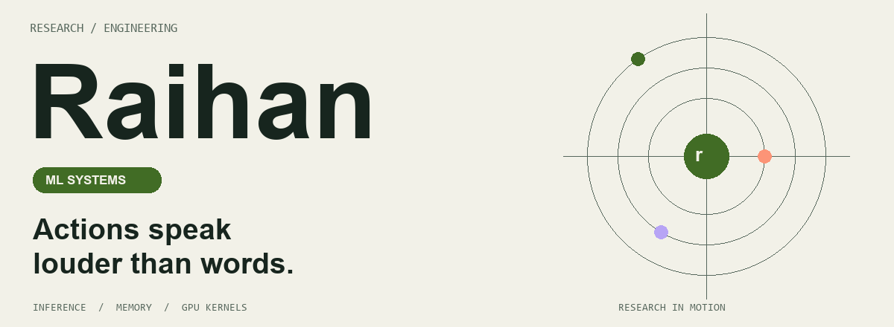
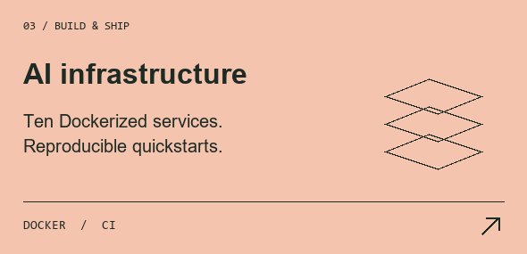

<picture>
  <source media="(prefers-color-scheme: dark)" srcset="assets/studio/hero-dark.gif" />
  <source media="(prefers-color-scheme: light)" srcset="assets/studio/hero-light.gif" />
  
</picture>

  <b>LLM inference &nbsp;·&nbsp; GPU kernels &nbsp;·&nbsp; Distributed systems</b>

  <a href="https://theraihanrakibb.github.io/">Portfolio</a> &nbsp; / &nbsp;
  <a href="https://linkedin.com/in/theraihanrakib">LinkedIn</a> &nbsp; / &nbsp;
  <a href="mailto:raihanrakib.143@gmail.com">Email</a> &nbsp; / &nbsp;
  <a href="Raihan_Research_Resume.pdf">Research CV</a> &nbsp; / &nbsp;
  <a href="Raihan_Technical_Resume.pdf">Technical CV</a>

## Selected work

  
  
  
  

## Tech stack

  <strong>Languages &amp; GPU kernels</strong> 
  
  
  
  
  

  <strong>Inference &amp; memory</strong> 
  
  
  
  
  
  

  <strong>Infrastructure &amp; profiling</strong> 
  
  
  
  

## Research & experience

I work on **distributed LLM inference and low-bit GPU kernels** to make long-context agent rollouts cheaper to run.

- **SJTU ReArch Lab · Research Intern** — CUDA and Triton kernels, plus FP8/FP4 KV-cache compression.
- **Approaching.AI · Distributed Inference R&D Intern** — Mooncake’s C++ transfer engine, RDMA, and KV-cache offloading for agent RL, in collaboration with Tsinghua MADSys.

### Selected results

> **55 s → 6.7 s time to first token** at a **92% KV-cache hit rate** with three-tier Mooncake RDMA offloading on 4× A800 80 GB GPUs.
>
> **3.2× kernel speedup** over FP16 with **one-quarter of the memory** for FP4-packed Triton kernels in NVFP4-DiT. IEEE TNNLS, under review.

### Education

**Northwestern Polytechnical University** · Xi’an, China

- **M.E. Software Engineering** · 2024–2027 · Rank 2/87 · GPA 88/100 · Chinese Government Scholarship
- **B.E. Computer Science** · 2020–2024 · Rank 5/56 · GPA 85/100 · Outstanding Graduate · Presidential Scholarship

**More projects** · [Distributed Training Launcher](https://github.com/theraihanrakibb/train-launcher) · [Confidential Spark Queries](https://github.com/theraihanrakibb/spark-ckks-query)
