<picture>
  <source media="(max-width: 600px) and (prefers-color-scheme: dark)" srcset="assets/studio/trimmed-hero-mobile-dark.svg" />
  <source media="(max-width: 600px)" srcset="assets/studio/trimmed-hero-mobile-light.svg" />
  <source media="(prefers-color-scheme: dark)" srcset="assets/studio/trimmed-hero-dark.svg" />
  
</picture>

   
  <a href="https://theraihanrakibb.github.io/">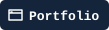</a>
  
  
  
  

## <samp>Selected Work</samp>

  <a href="https://github.com/kvcache-ai/Mooncake"></a>
  
  
  

## <samp>Tech Stack</samp>

  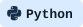
  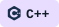
  
  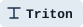
  

  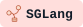
  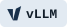
  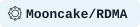
  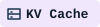
  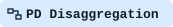
  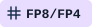

  
  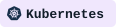
  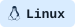
  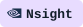

## <samp>Research & Experience</samp>

  
  

<samp>Collaborations</samp>

  <a href="https://github.com/kvcache-ai/Mooncake"></a>
  
  

## <samp>Selected Results</samp>

  
  

## <samp>Education</samp>

  
  

---

### <samp>More Projects</samp>

  
  
  
  

## <samp>Activity</samp>

<a href="https://github.com/theraihanrakibb#contribution-activity">
  <picture>
    <source media="(prefers-color-scheme: dark)" srcset="assets/studio/activity-blue-dark.svg" />
    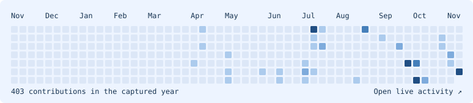
  </picture>
</a>
